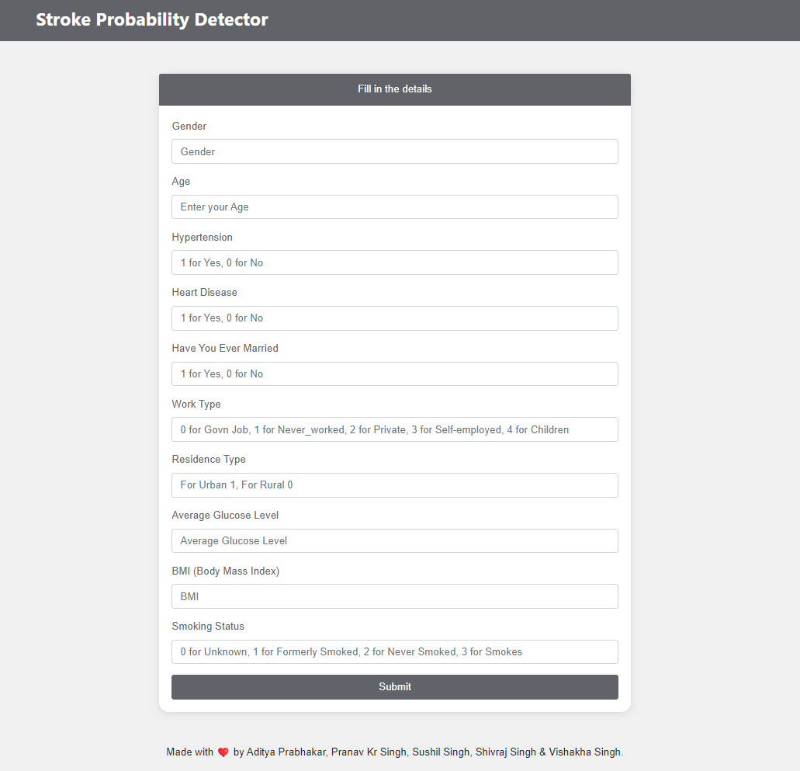
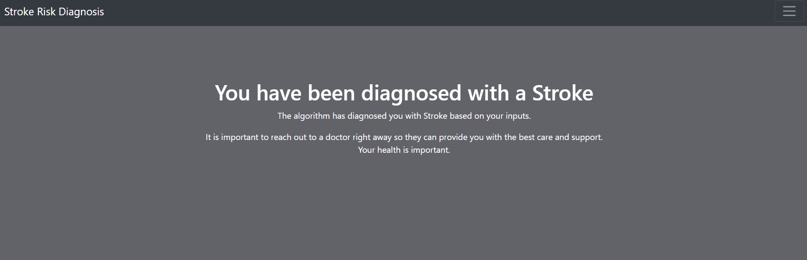
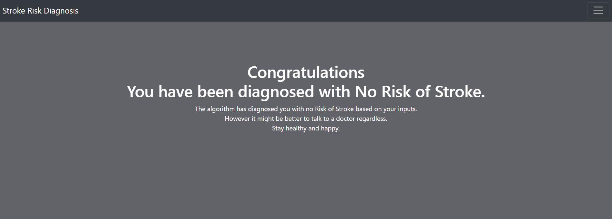
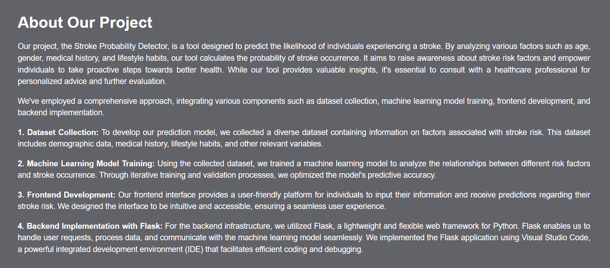

# Stroke Probability Detector

## Overview

The Stroke Probability Detector is a tool designed to predict the likelihood of individuals experiencing a stroke. By analyzing various factors such as age, gender, medical history, and lifestyle habits, our tool calculates the probability of stroke occurrence. It aims to raise awareness about stroke risk factors and empower individuals to take proactive steps towards better health. While our tool provides valuable insights, it's essential to consult with a healthcare professional for personalized advice and further evaluation.

## Key Components

### 1. Dataset Collection

To develop our prediction model, we collected a diverse dataset containing information on factors associated with stroke risk. This dataset includes demographic data, medical history, lifestyle habits, and other relevant variables.

### 2. Machine Learning Model Training

Using the collected dataset, we trained a machine learning model to analyze the relationships between different risk factors and stroke occurrence. Through iterative training and validation processes, we optimized the model's predictive accuracy.

### 3. Frontend Development

Our frontend interface provides a user-friendly platform for individuals to input their information and receive predictions regarding their stroke risk. We designed the interface to be intuitive and accessible, ensuring a seamless user experience.

### 4. Backend Implementation with Flask

For the backend infrastructure, we utilized Flask, a lightweight and flexible web framework for Python. Flask enables us to handle user requests, process data, and communicate with the machine learning model seamlessly. We implemented the Flask application using Visual Studio Code, a powerful integrated development environment (IDE) that facilitates efficient coding and debugging.

## Screenshots

### Home Page

### Diagnosed with Risk of Stroke Page

### Diagnosed with No Risk of Stroke Page

### About Page

## Usage

To use the Stroke Probability Detector, follow these steps:

1. Clone the repository to your local machine.
2. Install the required dependencies.
3. Run the Flask application.
4. Access the frontend interface via the provided URL.
5. Input your information and receive predictions regarding your stroke risk.

## Contributors

- [Aditya Prabhakar](https://github.com/Adit-Prabhakar)
- [Pranav Kumar SIngh](https://github.com/PranavKrSingh)
- [Shivraj Singh](https://github.com/SHIVRAJ420)
- [Vishakha Singh](https://github.com/vishakhas13)
- [Sushil Kumar](https://github.com/contributor2)

<!--## License

This project is licensed under the [MIT License](LICENSE).-->
